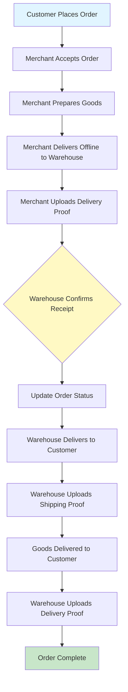
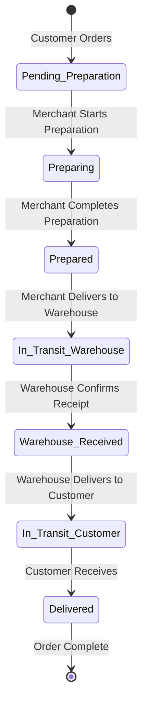
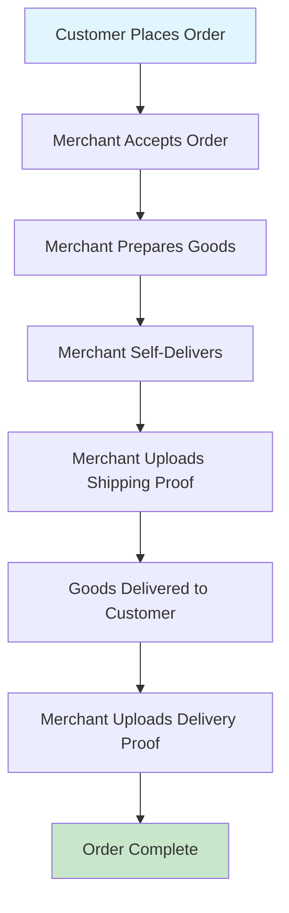
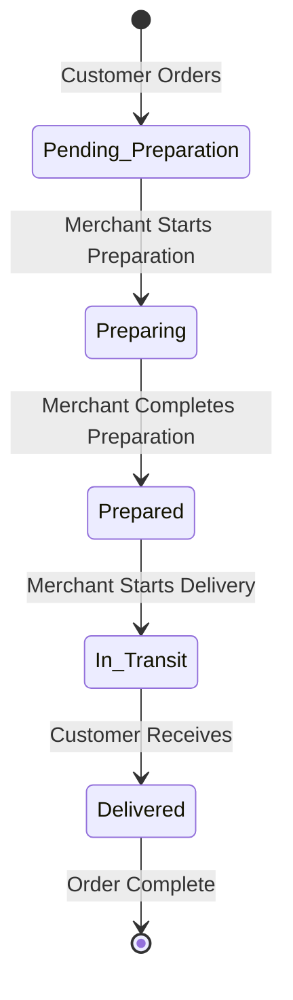
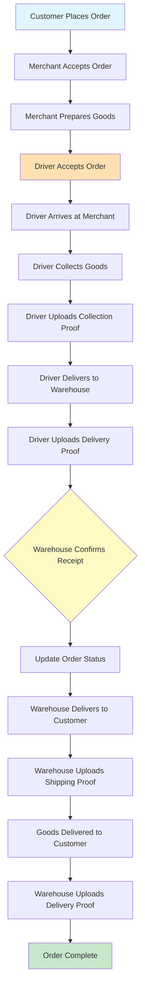
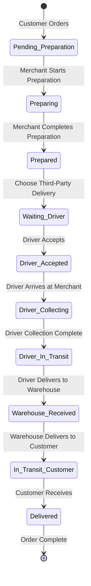
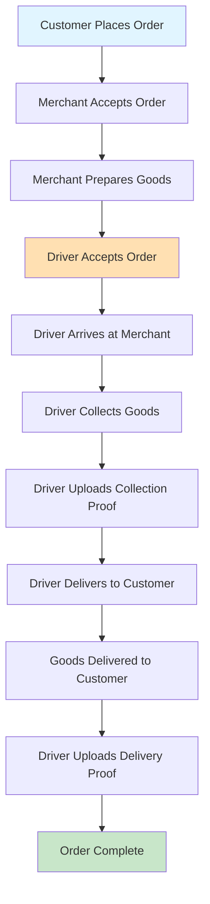
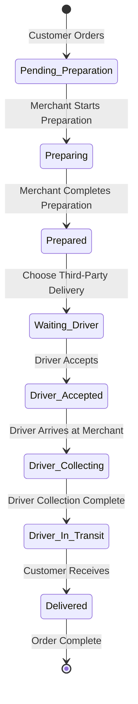
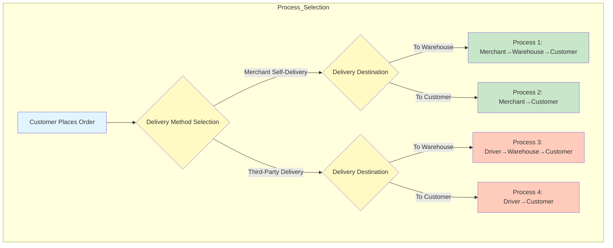

# Delivery Process Documentation

## Overview

Business roles include three types: **Merchant**, **Driver**, **Warehouse**

In the mall order system, delivery is divided into 4 scenarios:

1. Merchant self-delivery, goods delivered to warehouse
2. Merchant self-delivery, goods delivered to customer
3. Third-party delivery, goods delivered to warehouse
4. Third-party delivery, goods delivered to customer

After a user successfully places an order, it enters the merchant order system. The merchant's first step: prepare goods. The merchant selects one or more orders, submits completion of goods preparation. Choose whether this shipment will be self-delivered or third-party delivered, and whether to ship to warehouse or to customer, upload proof, and update order and goods preparation status.

---

## Process 1: Merchant Self-Delivery, Goods Delivered to Warehouse

### Process Description

1. **Merchant Prepares Goods**
   - Merchant delivers goods offline to designated warehouse
   - Merchant submits delivery proof in backend system
   - Synchronously updates order preparation table status and saves proof

2. **Warehouse Receives Goods**
   - Warehouse delivers goods to customer
   - Before warehouse ships, need to add goods proof in backend management
   - Synchronously updates order preparation table status and saves proof

3. **Customer Receives Goods**
   - After goods are delivered to customer
   - Warehouse needs to upload delivery proof
   - Synchronously updates order preparation table status and saves proof

### Flow Diagram

### State Transition

---

## Process 2: Merchant Self-Delivery, Goods Delivered to Customer

### Process Description

1. **Merchant Prepares and Delivers**
   - Merchant operates shipping in backend, submits shipping proof
   - Synchronously updates order preparation table status and saves proof

2. **Goods Delivered to Customer**
   - Goods successfully delivered to customer
   - Merchant submits delivery proof in backend
   - Synchronously updates order preparation table status and saves proof

### Flow Diagram

### State Transition

---

## Process 3: Third-Party Delivery, Goods Delivered to Warehouse

### Process Description

1. **Driver Accepts Order**
   - Driver can accept order in driver app
   - Driver collects goods from merchant
   - Driver arrives at merchant location, collects goods
   - Uploads collection proof
   - Synchronously updates order preparation table status and saves proof

2. **Driver Delivers to Warehouse**
   - Driver delivers goods to warehouse
   - Driver uploads proof
   - Synchronously updates order preparation table status and saves proof

3. **Warehouse Receives and Delivers**
   - Warehouse delivers goods to customer
   - Before warehouse ships, need to add goods proof in backend management
   - Synchronously updates order preparation table status and saves proof

4. **Customer Receives Goods**
   - After goods are delivered to customer
   - Warehouse needs to upload delivery proof
   - Synchronously updates order preparation table status and saves proof

### Flow Diagram

### State Transition

---

## Process 4: Third-Party Delivery, Goods Delivered to Customer

### Process Description

1. **Driver Accepts Order and Collects**
   - Driver can accept order in driver app
   - Driver delivers goods to customer
   - Driver first needs to collect goods from merchant, collection requires uploading proof
   - Synchronously updates order preparation table status and saves proof

2. **Driver Delivers to Customer**
   - Driver successfully delivers goods to customer
   - Uploads proof
   - Synchronously updates order preparation table status and saves proof

### Flow Diagram

### State Transition

---

## Process Comparison Overview

---

## Role Responsibilities

### Merchant
- Receive orders
- Prepare goods
- Self-deliver (Process 1, 2) or wait for driver pickup (Process 3, 4)
- Upload relevant proofs

### Driver (Third-Party Delivery)
- Accept orders
- Collect goods from merchant
- Deliver to warehouse or customer
- Upload collection and delivery proofs

### Warehouse
- Receive goods from merchant or driver
- Secondary delivery to customer
- Upload shipping and delivery proofs

### Customer
- Place order
- Receive goods

---

## Proof Management

All processes require uploading the following proofs:

1. **Collection Proof**: Confirms goods have been collected from merchant
2. **Shipping Proof**: Confirms goods have been shipped to next stage
3. **Delivery Proof**: Confirms goods have been delivered to destination

Each proof upload synchronously updates the order preparation table status.

---

## Order Status Description

| Status | Description |
|--------|-------------|
| Pending_Preparation | Order created, waiting for merchant preparation |
| Preparing | Merchant is preparing goods |
| Prepared | Merchant preparation complete |
| Waiting_Driver | Waiting for third-party driver to accept |
| Driver_Accepted | Driver has confirmed acceptance |
| Driver_Collecting | Driver is collecting goods at merchant |
| Driver_In_Transit | Driver is in transit |
| In_Transit_Warehouse | Goods being delivered to warehouse |
| Warehouse_Received | Warehouse has confirmed receipt |
| In_Transit_Customer | Goods being delivered to customer |
| Delivered | Goods delivered to final customer |
| Order_Complete | Order process fully completed |
