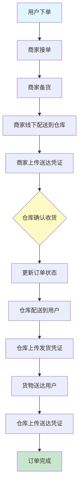
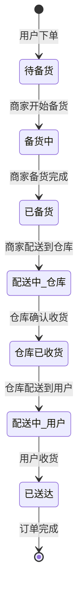
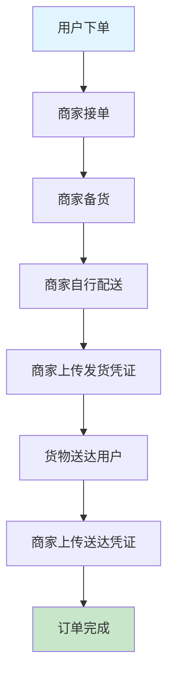
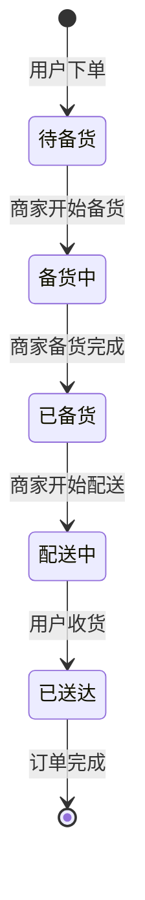
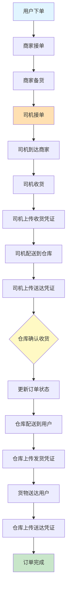
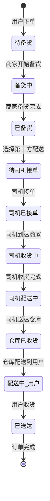
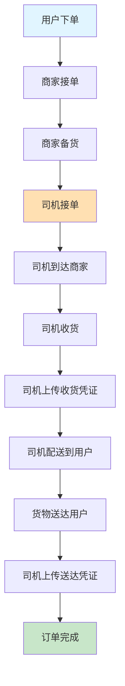
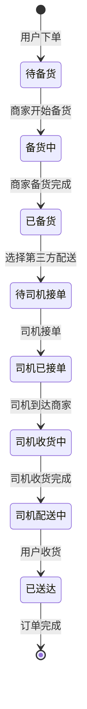
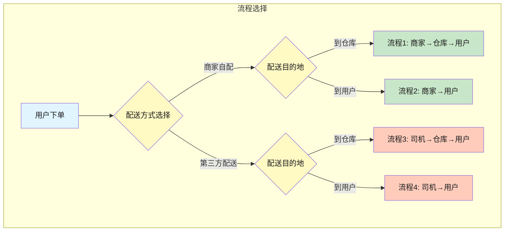

# 配送流程文档
## table 
**tigu_prepare_goods**:  

prepared packages for driver to work on

**tigu_prepare_goods_item**: 

the items in the prepared packages  
(can be used for display detail items of the package)

** tigu_order_action **:

   订单所有流程操作，凭证需要记录在tigu_order_action表，同时需要同步修改订单表中的状态以及备货表的状态。Tigu_order_action每次操作（备货完成，司机收货，送达仓库等）新增一条数据。
	tigu_order_action必填字段：
   id（雪花算法ID）,
   create_by（创建人，当前操作人）,
   create_time（创建时间）,
   order_id（本次操作关联的订单ID）,
action_type（操作类型(0备货，1司机收货，2仓库收货，3仓库发货，4完成，5用户申请退款，6商家允许退货 7商家不允许退货 8商家同意退款 9商家拒绝退款 10用户退货信息凭证11.司机送达仓库)）,
logistics_voucher_file（文件ID列表，多个用,分割，tigu_uploaded_files表的id）

** tigu_uploaded_files **

字段：
id（雪花算法ID），file_name（文件名称），file_url（文件完整路径），file_size（文件大小），biz_id（文件关联的相关ID，如商品图片，biz_type=product_sku，biz_id=商品SKU的id）

## 概述

业务角色包括三种：**商家**、**司机**、**仓库**

商城订单中，配送分为 4 种情况(table tigu_prepare_goods)：

1. 商家自行配送，货物配送到仓库 (delivery_type 0, shipping type 0)
2. 商家自行配送，货物配送到用户 (delivery type 0, shippgin type 1)
3. 第三方配送，货物配送到仓库 (delivery type 1, shipping type 0)
4. 第三方配送，货物配送到用户 (delivery type 1, shipping type 1)

用户成功下单后进入商家订单。商家操作第一步：备货。商家选择一个或者多个订单，提交备货完成，备货完成。选择本次备货为自行配送，或者第三方配送，以及发货到仓库或者发货到用户，并上传凭证，修改订单、备货状态。

---

## 流程 1：商家自行配送，货物配送到仓库

### 流程描述

1. **商家备货**
   - 商家线下将货物配送到指定仓库
   - 商家后台提交货物送达凭证
   - 同步修改订单备货表状态、保存凭证

2. **仓库收货**
   - 仓库将货物配送到用户手中
   - 仓库发货前，需要在后台管理中添加货物凭证
   - 同步修改订单备货表状态、保存凭证

3. **用户收货**
   - 货物送达到用户后
   - 仓库需要上传货物送达凭证
   - 同步修改订单备货表状态、保存凭证

### 流程图

### 状态流转

---

## 流程 2：商家自行配送，货物配送到用户

### 流程描述

1. **商家备货并配送**
   - 商家后台操作发货，提交发货凭证
   - 同步修改订单备货表状态、保存凭证

2. **货物送达用户**
   - 货物成功送达用户
   - 商家后台提交商品送达凭证
   - 同步修改订单备货表状态、保存凭证

### 流程图

### 状态流转

---

## 流程 3：第三方配送，货物配送到仓库

### 流程描述

1. **司机接单**
   - 司机端可接订单
   - 由司机收货，司机到达商家，收取货物
   - 上传收货凭证
   - 同步修改订单备货表状态、保存凭证

2. **司机配送到仓库**
   - 司机将商品送达仓库
   - 司机上传凭证
   - 同步修改订单备货表状态、保存凭证

3. **仓库收货并配送**
   - 仓库将货物配送到用户手中
   - 仓库发货前，需要在后台管理中添加货物凭证
   - 同步修改订单备货表状态、保存凭证

4. **用户收货**
   - 货物送达到用户后
   - 仓库需要上传货物送达凭证
   - 同步修改订单备货表状态、保存凭证

### 流程图

### 状态流转

---

## 流程 4：第三方配送，货物配送到用户

### 流程描述

1. **司机接单并收货**
   - 司机端可接单
   - 并将货物送达用户
   - 司机首先需要到商家出收货，收货需要上传凭证
   - 同步修改订单备货表状态、保存凭证

2. **司机配送到用户**
   - 司机将货物成功送达到用户
   - 上传凭证
   - 同步修改订单备货表状态、保存凭证

### 流程图

### 状态流转

---

## 流程对比总览

---

## 角色职责

### 商家
- 接收订单
- 备货
- 自行配送（流程 1、2）或等待司机取货（流程 3、4）
- 上传相关凭证

### 司机（第三方配送）
- 接单
- 到商家处收货
- 配送到仓库或用户
- 上传收货和送达凭证

### 仓库
- 接收商家或司机送来的货物
- 二次配送到用户
- 上传发货和送达凭证

### 用户
- 下单
- 接收货物

---

## 凭证管理

所有流程中都需要上传以下凭证：

1. **收货凭证**：确认货物已从商家处取出
2. **发货凭证**：确认货物已发往下一环节
3. **送达凭证**：确认货物已送达目的地

每次凭证上传都会同步更新订单备货表状态。

---

## 订单状态说明
tigu_prepare_goods: column ：prepare_status
| 状态 | 说明 |
|------|------|
| 待备货 | 订单已生成，等待商家备货 （null）|
| 已备货 | 商家备货完成(商家备货完成拍照) （0） |
| 司机收货中 | 司机正在商家处收货(司机收货拍照) （1） |
| 司机收货完成送货仓库 | 司机送货到仓库(司机送达拍照) （2）|
| 仓库已收货 | 仓库已确认收货(仓库管理拍照) (3)|
| 司机配送到用户 | 货物正在送往用户(司机收货拍照) (4) |
| 已送达 | 货物已送达最终用户(司机拍照) (5)|
| 订单完成 | 订单流程全部完成 (6)|
